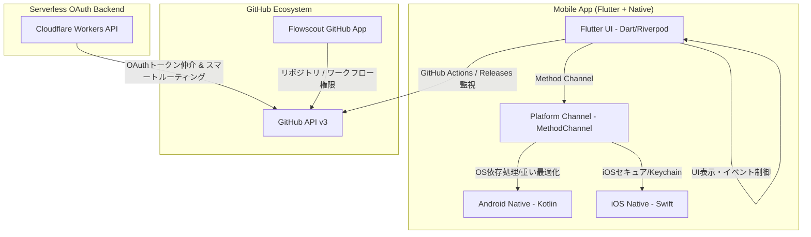

# 🚀 Flowscout

  <a href="README.md"><b>🇺🇸 英語 (English)</b></a>

  
  
  
  

---

**Flowscout** は、スマートフォンで直感的に **GitHub Actions** の実行結果やエラー詳細をリアルタイム監視できる、完全無料・オープンソースのモバイルアプリケーション（iOS & Android）です。

「外出先やベッドの中からでも、CI/CDのエラー原因を一瞬で特定したい」という開発者の悩みを解決します。

## 🌟 主な特徴

1. 👥 **マルチアカウントの瞬時切り替え**
   * アプリ内で複数のGitHubアカウントを登録し、シームレスに切り替えて使用可能（トークンはセキュアに管理）。
2. 🔍 **高度なフィルターと柔軟なソート順**
   * リポジトリタイプ（Public/Private）、オーナータイプ（個人/組織）、および特定のアカウント名（GitHubのアバター画像付きチップ）でリポジトリリストを絞り込める極上のBottomSheetフィルター。
   * 並び替えオプションに「最後のCI/CD実行順」（デフォルト）を追加し、「最終更新順」「名前順」「スター順」にも対応。
3. 🚨 **インテリジェントなログ解析と自動ジャンプ**
   * ジョブやステップのステータスを可視化。失敗したステップをタップすると、ログ内の最初のエラー（`##[error]`）が発生した行へ自動で瞬時にスクロール。
4. 🛡️ **セキュアな「スマート・ルーティング」OAuth連携**
   * Cloudflare Workersを仲介したサーバーレスOAuthを搭載。Client Secretのアプリ内漏洩リスクをゼロに。
   * 「先にAppをインストールしたか、先にログインしたか」の順序を問わず、自動で必要な設定画面（インストール）へ誘導する極上のUX。
5. 🔄 **自動アプデチェック機能**
   * 起動時にGitHub Releasesから最新リリースバージョンを自動検出してアップデートを通知（設定でオフ可能）。

---

## 🏗️ システムアーキテクチャ

Flowscoutは、UI/フロントを **Flutter (Dart)** で統一し、ロジック・OS依存処理・セキュア暗号化などの裏処理を **Kotlin (Android) / Swift (iOS)** のネイティブ言語に委ねるハイブリッド最適化構成を採用しています。

---

## 🛠️ 複数CI/CDフォールバック＆自動化

Flowscoutは「生涯0円での開発・運用」を可能にするため、複数のCI/CDサービスの無料プランを切り替える**「フォールバック設計」**を採用しています。

*   **GitHub Actions:** メインのオーケストレーター。`master` ブランチへのPush/Merge時に起動し、静的解析・自動テスト実行後、GitHub Releasesへドラフト自動公開。
*   **自動フォールバックスクリプト (`scripts/trigger-ci-fallback.sh`):**
    GitHub Actionsが無料枠制限（HTTP 429や402など）を検知した場合、API経由で **Codemagic ➔ Bitrise ➔ Travis CI ➔ CircleCI** を優先順位に従って自動で順番にキックし、ビルドを無停止で継続します。

---

## 🍏 / 🤖 インストール & サイドロード

公式ストアの登録料を一切発生させず完全0円で運用するため、以下の代替手段でアプリパッケージを配布しています。

### Android
*   **F-Droid:** F-Droidクライアントから検索してインストール。
*   **GitHub Releases:** リポジトリの [Releases](https://github.com/tadanobutubutu/flowscout/releases) ページから直接最新の APK / AAB ファイルをダウンロードしてインストール。

### iOS (iPadOS / macOS対応)
*   **AltStore:** IPAファイルをダウンロードし、AltStore等を使用してサイドロード。
*   **GitHub Releases:** リポジトリから直接IPAパッケージを取得可能。

---

## 🤝 コントリビューション & 多言語化 (Crowdin)

Flowscoutは、PRを大歓迎するOSS（オープンソース）プロジェクトです！

*   **多言語化:** Crowdinとの統合機能（`crowdin.yml`）を完備しています。言語リソースは `lib/src/localization/` 配下のARBファイル（`app_en.arb`, `app_ja.arb`）で構成されています。
*   **貢献方法:** 開発時のルールやブランチ運用（GitFlow）は [CONTRIBUTING.md](CONTRIBUTING.md) をご確認ください。

---

## 📄 ライセンス

本プロジェクトは **MIT ライセンス** の下で提供されています。詳細は [LICENSE](LICENSE) ファイルをご覧ください。
