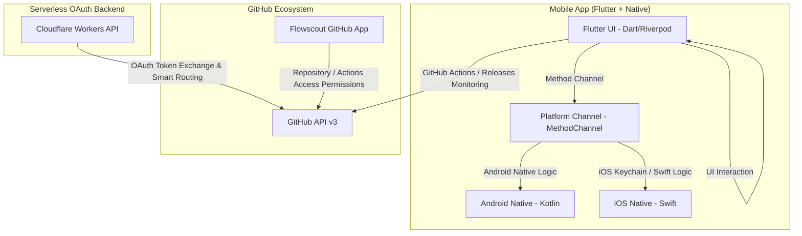

# 🚀 Flowscout

  <a href="README.ja.md"><b>🇯🇵 日本語 (Japanese)</b></a>

  
  
  
  

---

**Flowscout** is a completely free, open-source mobile application (iOS & Android) designed to let developers intuitively monitor **GitHub Actions** execution results and error details in real-time right from their smartphones.

Say goodbye to the stress of diagnosing CI/CD build failures when you are away from your desk.

## 🌟 Key Features

1. 🔍 **Lightning-Fast Repository Search**
   * Real-time search to instantly locate the exact repository (public or private) you own or contribute to. No endless scrolling.
2. 🚨 **In-Depth Error Log Isolation**
   * Smartly expands workflow runs using custom UI cards.
   * Pinpoints exactly which job and step failed, displaying raw error details and highlights on your phone.
3. 🛡️ **Secure "Smart-Routing" OAuth Authentication**
   * Uses serverless OAuth brokered via Cloudflare Workers to eliminate Client Secret leakage risks.
   * Seamless "Smart-Routing" UX that automatically redirects users to the GitHub App installation screen if not yet installed, regardless of whether they log in or install first.
4. 🔄 **Automated Update Alerts**
   * Auto-detects the latest release from GitHub Releases upon startup and prompts the user to update (can be disabled in Settings).

---

## 🏗️ System Architecture

Flowscout optimizes mobile performance by implementing its UI layer in **Flutter (Dart)** while delegating OS-dependent, secure storage, and background processing to native **Kotlin (Android)** and **Swift (iOS)** codebases.

---

## 🛠️ Multi-CI/CD Fallback Strategy

To ensure "Lifetime $0 Cost" operation, Flowscout implements a robust **Fallback Orchestration** script:

*   **GitHub Actions:** Acts as the primary orchestrator. Triggers only on `master` branch pushes, runs automatic QA (linter/tests), and drafts GitHub Releases.
*   **Automatic Fallback Script (`scripts/trigger-ci-fallback.sh`):**
    If GitHub Actions triggers fail due to rate limits (HTTP 429/402), it automatically invokes **Codemagic ➔ Bitrise ➔ Travis CI ➔ CircleCI** sequentially via API, keeping builds running seamlessly.

---

## 🍏 / 🤖 Installation & Sideloading

To avoid developer fees and remain 100% free, we distribute Flowscout via alternative channels:

### Android
*   **F-Droid:** Search and install via the F-Droid Client.
*   **GitHub Releases:** Download secure APK/AAB files directly from the [Releases](https://github.com/tadanobutubutu/flowscout/releases) page.

### iOS (supports iPadOS & macOS)
*   **AltStore:** Sideload by downloading the IPA package.
*   **GitHub Releases:** IPA packages are compiled and hosted directly in the repository releases.

---

## 🤝 Contributing & Internationalization (Crowdin)

We highly welcome PRs! Flowscout is an open-source (OSS) project:

*   **Localization:** Built-in Crowdin configuration (`crowdin.yml`) automatically syncs translation resources (`lib/src/localization/app_en.arb` and `app_ja.arb`).
*   **Guidelines:** Refer to [CONTRIBUTING.md](CONTRIBUTING.md) for code styling, conventional commits, and GitFlow branching strategies.

---

## 📄 License

This project is licensed under the **MIT License**. See the [LICENSE](LICENSE) file for details.
